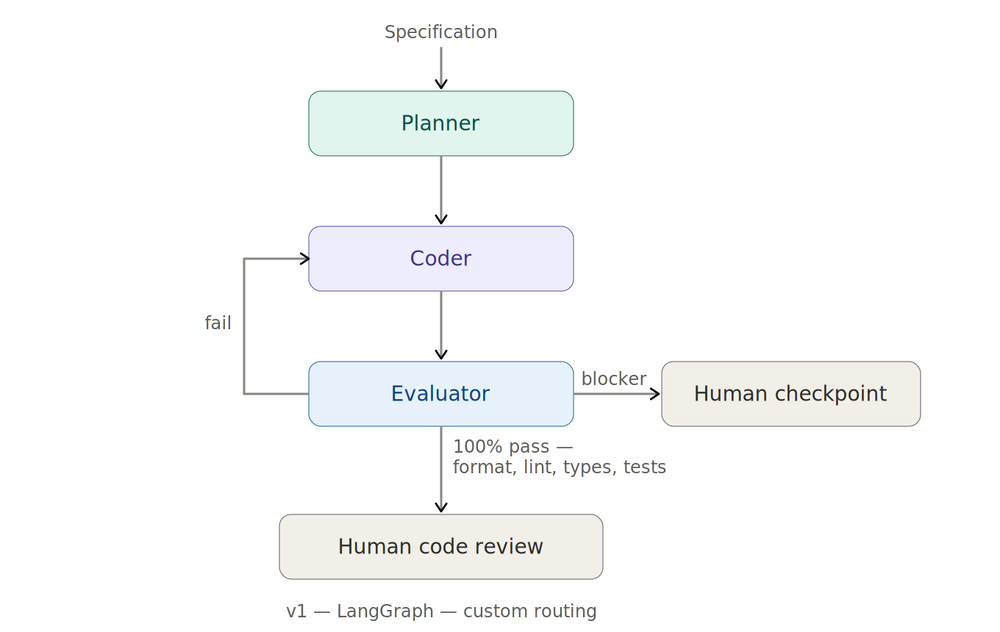
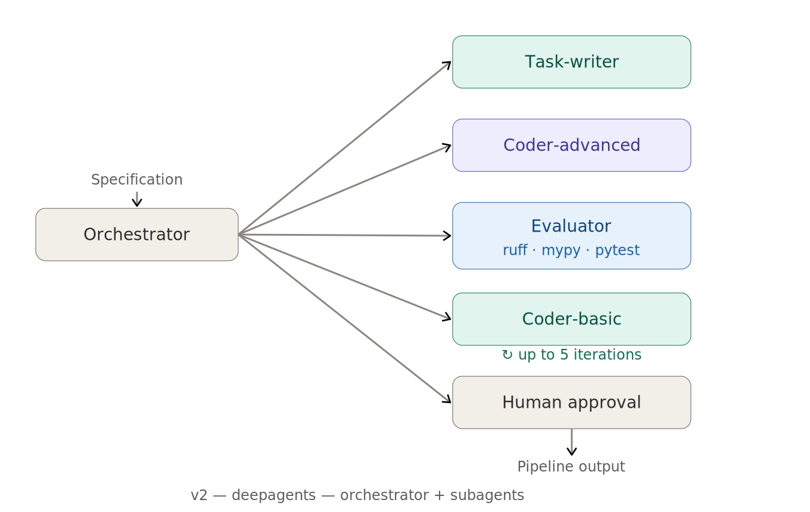

# pipeline-forge
**Agentic system that generates tested, production-ready O&G data pipelines from a plain-English spec.**

Tested on two oil and gas production datasets — Kansas Geological Survey and Colorado ECMC — different data sources, same agent, same quality bar.

---

## What Was Built

The pipeline covers four stages: data acquisition, ingestion (Dask), transformation and cleaning with domain-specific validation, and feature engineering (decline curves, rolling stats, GOR). Output is Parquet partitioned by well ID, ready for ML workflows.

Architecture: an orchestrator delegating to three specialized subagents — task-writer (designs component specifications), coder-advanced (implements from specs), coder-basic (applies targeted fixes) — with a deterministic evaluator (ruff, mypy, pytest) closing the feedback loop.

The framework generalizes: onboarding a new data source requires a short project spec file and a test requirements file — no changes to the agent itself. That is the core of what makes this operationally useful — not just for oil and gas pipelines, but for any operation where data from multiple sources needs to be reliably integrated, validated, and kept current.

---

## Two Architectures

The system above wasn't the starting point. The first version was a lower-level LangGraph graph with custom context trimming and custom routing. Things broke repeatedly, and fixing each problem built an intuition for how LLMs actually work that is hard to get any other way.

Two lessons stood out. First, LLMs don't think top-down the way humans do. They don't need to progress from requirements → architecture → design → code. Working from priors and current context, they can go directly from requirements → tasks → code — often in parallel. Intermediate design artifacts that would be essential for a human team are often just expensive tokens for an LLM. Second, context bloat is a constant problem. Read and write tool calls append file content to the message history, and stale tool call inputs and outputs accumulate silently. Learning what to keep and what to trim — and when — is one of the core LLM engineering skills.

Switching to deepagents with an orchestrator→subagents architecture addressed context bloat more cleanly than the custom trimming approach: automatic context offloading, filesystem abstraction, subagent context isolation. The codebase also shrank significantly without custom routing and middleware. The tradeoff was less control and more abstraction — which made LangSmith trace analysis essential for understanding what was actually happening inside runs.

---

## Generalizing to a Second Dataset

The initial build targeted a single data source. The question was whether the same agent could handle a different one without changes to the agent itself. The second dataset was Colorado ECMC (Energy & Carbon Management Commission) well production data — different schema, different download pattern (bulk CSV zip vs per-lease HTTP scrape), different date format. Onboarding required writing two files: task-writer-cogcc.md (dataset description, download instructions, domain constraints) and test-requirements-cogcc.xml (schema completeness check with ECMC column names). No agent code changed.
The COGCC pipeline processed 4.3M rows across all four stages. KGS processed 1.2M. Both passed the same eval gates on the fifth iteration. The framework for adding a third data source is the same two-file process.

---

## Performance Guardrails — Keeping the Big Picture

The agent gets tasks done reliably. What it doesn’t do is hold system-level objectives across tasks — that’s not how LLMs work. Each task is solved in its own context. The result, in this case, was a pipeline that used Dask correctly at the function level but missed the bigger requirement: this is a parallel processing pipeline where memory and latency matter. Sequential computes, single-partition loads, sort before shuffle — each individually reasonable, collectively a problem at scale.
The fix was encoding the system-level requirements as explicit constraints in task-writer.md. Vectorised operations only. Batch computes. Repartition before write. Sort after shuffle. What looked like an agent limitation is really a prompt engineering problem. This applies to any agentic system working on complex, multi-step tasks — not just data pipelines.

---

## Open Problems

**Test quality — baseline established, gaps known.** Each pipeline is validated against two layers of quality checks: deterministic gates (linting, type checking, unit tests) and a separate LLM-as-judge evaluation that assesses whether the tests cover the domain correctly — not just whether the code runs.

*Test quality:* 80% across all stages except acquire (70%) — tests cover edge cases and avoid trivial assertions

*Structural correctness:* 80% across all four stages — Dask laziness, schema validation, partition structure

*Domain correctness:*
80% for acquire, ingest, and feature-extraction stages. 
60% for KGS transform stage — the tests don't fully cover physical bounds validation, water cut boundary values, and the zero-vs-null distinction after transformation. COGCC eval scores pending.

The gap is in the test specification — not the code.

**Run-to-run reliability is work in progress.** KGS and COGCC both passed on the fifth eval-fix iteration. Not enough runs across configurations to characterize cost variance or failure modes at scale.

**Data security and governance are not addressed.** Public KGS and COGCC data only. No authentication, no data governance, no client constraints.

---

## Next

Next data source is Texas RRC (Railroad Commission) — EBCDIC format, different schema, more complex acquire. The generalization framework is in place; RRC will test how much of the constraint set transfers versus what needs to be learned again. Longer term: systematic experiments varying agent configuration — model choice, context limits, constraint specificity — with judge scores alongside cost and iteration count as outcome metrics.

---

## Stack

Python · Dask · LangGraph · Claude (Anthropic) · KGS Kansas · COGCC Colorado
