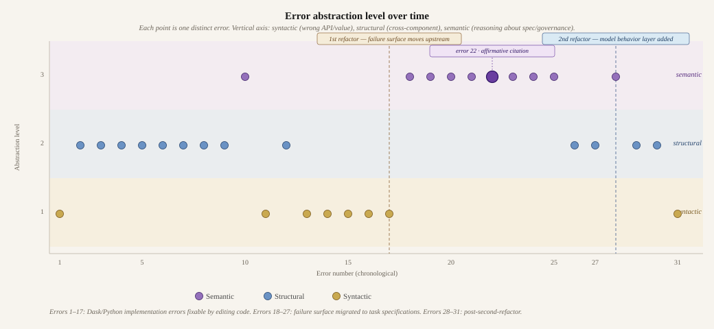
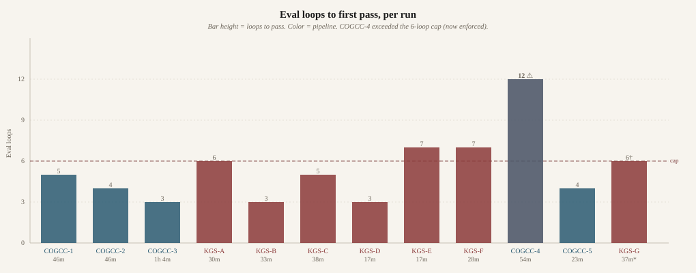
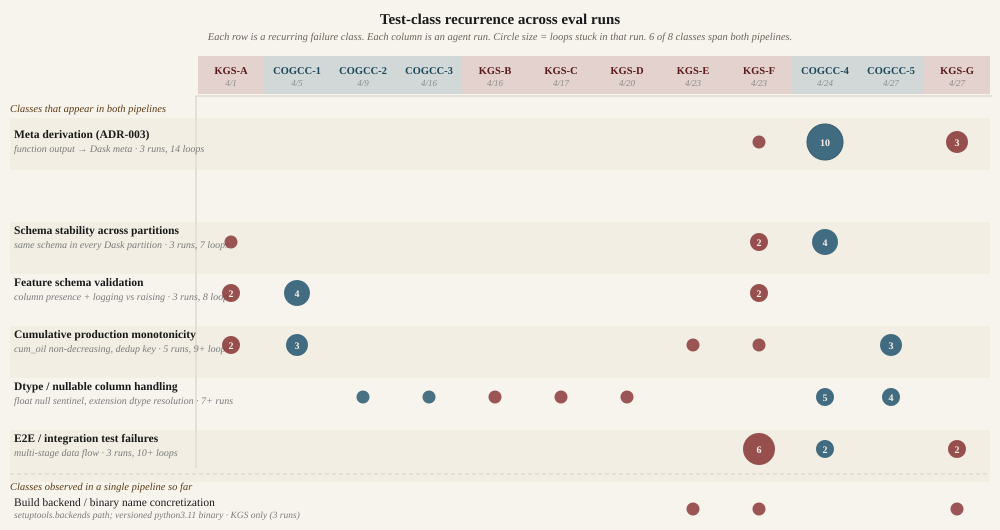

# pipeline-forge

*Agentic system that generates tested O&G data pipelines from a plain-English spec.*

  

---

## Getting Started

### Prerequisites

- Python 3.11+
- [Conda](https://docs.conda.io/en/latest/) for environment management
- [Anthropic API key](https://console.anthropic.com/) — Claude Sonnet and Haiku are used
- [LangSmith API key](https://smith.langchain.com/) — for agent tracing (free tier works)

### Setup

```bash
# 1. Clone the repo
git clone https://github.com/sirisurab/pipeline-forge.git
cd pipeline-forge

# 2. Create and activate the Conda environment
conda env create -f environment.yml
conda activate dapi
```

Create a `.env` file in the repo root:

```
ANTHROPIC_API_KEY=your-anthropic-api-key
LANGSMITH_API_KEY=your-langsmith-api-key
LANGSMITH_PROJECT=pipeline-forge
PROJECT=kgs          # which project the agent builds — determines the working subdirectory
```

### Running the agent

Start the LangGraph server from the repo root:

```bash
langgraph dev
```

Open the LangGraph Studio URL printed on startup. Submit a run with your pipeline spec as the input message. Example prompt:

> Write a data pipeline to acquire, ingest, clean and process the KGS oil production data for 2024–2025. The pipeline must use parallel processing techniques. The processed files need to be ready for feature extraction and input to a Machine Learning and Analytics workflow.

The agent will write task specs, implement all pipeline modules and tests, run the eval loop (ruff + mypy + pytest) until all checks pass, then pause for human review before committing.

### Onboarding a new pipeline

Two files are required per project, placed in the repo root:

- `{project}-spec.md` — plain-English description of the data source, schema, and pipeline requirements
- `{project}-test-requirements.md` — domain-specific correctness criteria the generated tests must cover

Set `PROJECT={project}` in `.env`. No changes to the agent itself are needed.

---

## What Was Built

A four-stage data pipeline covering acquisition, ingestion, transformation, and feature engineering for oil and gas well production data — built entirely by an agentic system from a plain-English spec. Output is Parquet partitioned by well ID, validated against domain-specific correctness criteria, and ready for ML workflows. Features include per-well decline curves, cumulative production tracking, rolling statistics, and GOR computations across 1–5M row datasets.

The framework is built to generalize: onboarding a new data source requires a short project spec file and a test requirements file — no changes to the agent itself.

### Architecture

```
orchestrator
  ├── reads TaskIndex.md, routes errors, enforces 6-loop cap
  ├── task-writer        (Claude Sonnet)
  │     reads: project spec + test requirements + agent_docs/
  │     writes: TaskIndex.md + tasks/*.md
  ├── coder-advanced     (Claude Sonnet)
  │     scope: complex failures — integration, meta/schema, cross-stage
  ├── coder-basic        (Claude Haiku)
  │     scope: local, single-file — linting, type errors, simple unit failures
  └── evaluator          (deterministic)
        ruff + mypy + pytest → passed / failures / blockers
```

Context is isolated per subagent. `agent_docs/` holds the authoritative governance layer — ADRs (Architecture Decision Records), pipeline-stage manifests, stage-boundary contracts, build-env-manifest — read by all agents before every run. The orchestrator is the sole coordinator; subagents do not share conversation history. Human-in-the-loop reviews and approves each git commit.

| Pipelines tested | Agent runs logged | Distinct errors documented | Context words added | Rows processed |
|:---:|:---:|:---:|:---:|:---:|
| 2 | 13 | 31 | ~1,600 | 5.6M+ |

---

## Testing Methodology and Error Analysis

Both pipelines — KGS (Kansas Geological Survey, 1.2M rows) and COGCC (Colorado ECMC, 4.3M rows) — were tested across multiple agent runs. Each run triggered the eval loop: ruff, mypy, and pytest against a domain-specific test suite. Every failure was documented: root cause, manual fix, and the constraint added to the agent's context files. Testing alternated between pipelines to check generalization — a constraint earned on COGCC was tested on KGS, and vice versa.

### Error abstraction level over time



*Each point is one error. The vertical axis classifies the error by reasoning or abstraction level required for the fix for the error. The first phase (errors 1–17) is dominated by implementation-level (coder level) fixes — wrong API, meta mismatch, data-type issues. Beginning at error 18, errors were traced back to task-writer behavior. Fixing them required understanding task-writer behavior patterns, not coder limitations.*

### Eval loops to first pass, per run



*COGCC-4 ran 12 loops — the orchestrator did not enforce its 6-loop escalation rule. The cause was a state-recovery rule that re-triggered evaluation each time a run was cancelled and retried by the langgraph server. Both the cap enforcement and the recovery rule were corrected after that run. COGCC-5 (4 loops) and KGS-G (6 loops active) reflect the corrected orchestrator.*

### Test-class recurrence across eval runs



*At the test-class level — grouping errors by failure category — 6 of 8 clusters appeared in both pipelines, and approximately 73% of all eval loops involved a test-class failure that had already been seen in a prior run. This high recurrence rate was the primary motivation for the second context refactor.*

---

## What Error Patterns Revealed

### Localized (task-level) focus, lacking big picture

The earliest errors had a consistent shape: the coding agent solved each task correctly in isolation but failed to reason about cross-task (intra-stage) and cross-stage effects. Partition counts weren't propagated across stage boundaries. Sort order was destroyed because shuffle happened after sort. The distributed scheduler was applied to an I/O-bound stage that needed threads. Each function was correct in isoation; but the pipeline failed end-to-end.

The fix was encoding the system-level view the agent was missing: stage manifests defining what each stage must guarantee, boundary contracts defining what the next stage can rely on, and ADRs governing big picture decisions. After this refactor, cross-stage errors stopped recurring.

### The overfitting problem

Because testing alternated between two pipelines, constraints tended to be shaped by whichever pipeline was most recently tested. A fix written after a COGCC failure was concrete enough to prevent that specific error but not abstract enough to cover the same failure class in KGS — and vice versa. The constraint set grew larger and more internally inconsistent without actually converging.

> A constraint that prevents an error in both pipelines without referencing either pipeline's specific column names, file structure or project-specific behavior — that is what a stable constraint looks like. Generic intent-level, not example-level.

The second context refactor restructured the authority hierarchy: ADRs own all constraints, stage manifests own stage-specific patterns, task specs reference but never define. When task spec and ADR conflict, ADR wins — stated explicitly in the coder instruction.

### Model behavior patterns

Studying the second half of the error log revealed a different class of problem: predictable failure modes in the task-writing agent itself. The same patterns appeared across runs, triggered by identifiable structures in the spec — not by ambiguous data or missing context. When a task spec was silent on how something should be done but failed to cite the governing document, the coding agent filled the gap with a training prior rather than consulting the ADR. When the task spec and an ADR said different things, the coder followed the more specific instruction — the task spec — even when the ADR was authoritative. When the spec provided explicit URL templates for data acquisition, the task-writer over-engineered by adding an index-scraping discovery step, instead of following the spec.

These are not one-off bugs. They are consistent behavior patterns that can be anticipated from the shape of the spec before a run starts. The response was a new document — `model-behavior-constraints.md` — that gives the orchestrator nine failure patterns to scan for before delegating to task-writer, so preventive constraints can be added to the spec rather than discovered at eval time.

### Context as governance

| Document | Read by | Governs |
|---|---|---|
| `ADRs.md` | all agents | Dtype rules, partitioning, meta derivation, scheduler strategy, vectorization |
| `stage-manifest-*.md` | task-writer, coder-advanced | What each stage must guarantee at its input and output boundaries |
| `boundary-*.md` | task-writer, coder-advanced | What upstream stages deliver; what downstream stages can rely on |
| `build-env-manifest.md` | task-writer, coder-advanced | Build system, config structure, Makefile rules, scheduler initialization |
| `coding-patterns.md` | all coders | Cross-cutting implementation patterns — type narrowing, dtype preservation, test semantics |
| `model-behavior-constraints.md` | orchestrator, task-writer | Nine failure patterns to scan for *before* delegating to task-writer and for task-writer to prevent common failure modes|

---

## Open Problems and Next

- **Two errors found by manual end-to-end testing after eval passed.** Non-monotonic cumulative production (from Revised-report deduplication) and an all-null decline rate feature (from a `pd.Series` index alignment issue) both slipped past the automated eval gate. Neither had a test that exercised the failure condition. Both gaps are now in the test requirements file.

- **Run-to-run reliability is improving but not yet characterized.** Loop counts dropped meaningfully after the second context refactor. Formal characterization to predict agent behavior across mdoel configurations and constraint specificity levels requires more testing.

- **Convergence of eval-fix cycles is yet to be established** Determining relevant loss fucntions that can be measured and tracked to study convergence across eval+fix iterations is W.I.P. Studying convergence while also trying to generalize the system across more datasets is a challenge.

- **Next: Texas RRC (Railroad Commission).** EBCDIC format, different schema, more complex acquire pattern. Onboarding requires two files — a project spec and a test requirements file. The interesting measurement is how much of the existing constraint set transfers versus what needs to be relearned. That is the real test of generalization.

---

## Stack

Python · Dask · deepagents · Claude Sonnet (task-writer, coder-advanced) · Claude Haiku (coder-basic) · KGS Kansas · COGCC Colorado
